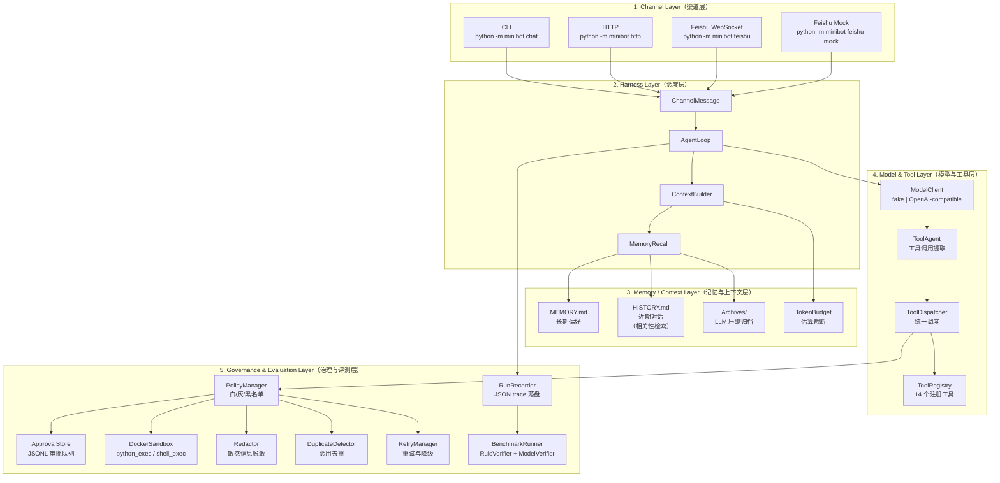

# MiniBot 架构说明

## 总体架构图



## 分层说明

### 1. Channel Layer（渠道层）

将外部输入标准化为 `ChannelMessage(channel, user_id, session_id, content, metadata)`，所有渠道复用同一消息协议。

| 渠道 | 实现状态 | 依赖外部配置 |
|---|---|---|
| CLI (`minibot chat`) | ✅ 已实现 | 无 |
| HTTP (`minibot http`) | ✅ 已实现 | 可选 `MINIBOT_HTTP_AUTH_TOKEN` |
| Feishu WebSocket (`minibot feishu`) | ✅ 真实接入边界 | 需 `FEISHU_APP_ID` + `FEISHU_APP_SECRET` |
| Feishu Mock (`minibot feishu-mock`) | ✅ 已实现 | 无（本地回归用） |

- **已实现**：CLI、HTTP、Feishu Mock 均可无外部配置独立运行。
- **依赖外部配置**：Feishu WebSocket 真实接入需飞书开放平台配置；缺配置返回 `feishu_config_missing`，不会 fallback mock。
- **后续可扩展**：新增渠道只需实现 `BaseChannel` 并产出 `ChannelMessage`，无需修改 Harness。

### 2. Harness Layer（调度层）

`AgentLoop.handle_message()` 是系统唯一执行入口。所有消息经过统一生命周期：

```text
SessionStart → UserMessageReceived → MemoryRecall → ContextBuild →
PlaceholderClean → ModelPlanning → [ToolCallDetected → PreToolUse →
ToolGovernanceCheck → ToolExecution → PostToolUse → ToolResultAppend]×N →
VerifierCheck → FinalResponseGenerate → HistoryPersist →
RunReportPersist → SessionEnd
```

工具循环受四维 budget 控制：

| 参数 | 默认值 | 环境变量 |
|---|---|---|
| `max_tool_rounds` | 3 | `MINIBOT_MAX_TOOL_ROUNDS` |
| `max_tool_calls_total` | 10 | `MINIBOT_MAX_TOOL_CALLS_TOTAL` |
| `max_runtime_seconds` | 60 | `MINIBOT_MAX_RUNTIME_SECONDS` |
| `max_same_tool_calls` | 2 | `MINIBOT_MAX_SAME_TOOL_CALLS` |

- **已实现**：完整生命周期、budget 控制、多轮 observe → re-plan、Hook 事件触发、context metrics 采集、evidence 大输出压缩。
- **mock / fake**：fake 模式下 `ModelClient` 使用 `FakeModelClient`（正则匹配），不产生真实 LLM 调用。
- **依赖外部配置**：real 模式需要 DeepSeek API key，否则返回 `deepseek_config_missing`。
- **后续可扩展**：新增 lifecycle 事件无需改循环主体；`AgentBudgetProfile` 可通过 `agent_profiles` 按名切换。

### 3. Memory / Context Layer（记忆与上下文层）

三层记忆结构：

```text
.minibot/
  MEMORY.md   ← 长期偏好/事实，全量注入系统 prompt
  HISTORY.md  ← 近期对话，按相关性检索 + token budget 截断
  archives/   ← LLM 压缩归档摘要（/new 手动 或 轮次阈值自动触发）
```

| 能力 | 实现状态 | 说明 |
|---|---|---|
| MEMORY.md 长期记忆 | ✅ 已实现 | `MemoryStore.write_memory_fact()`，显式"记住"触发 |
| HISTORY.md 对话记录 | ✅ 已实现 | 每轮自动追加 user/assistant 行 |
| 相关性检索 | ✅ 已实现 | token overlap + Jaccard 评分，top_k 注入 |
| Token budget 截断 | ✅ 已实现 | `ceil(len(text)/4)` 估算，超预算硬截断 |
| 占位清理 | ✅ 已实现 | 清理空 tool_result、重复 prompt、过长输出 |
| /new 压缩归档 (fake) | ✅ 已实现 | 规则式摘要，`compression_trigger=manual_new` |
| /new 压缩归档 (real) | ✅ 已实现 | LLM 调用生成摘要，缺 key 返回 `deepseek_config_missing` |
| 轮次阈值自动归档 | ✅ 已实现 | `compression_trigger=turn_threshold` |

- **已实现**：上述全部。
- **依赖外部配置**：LLM 压缩归档在 real 模式下需要 DeepSeek API key。
- **后续可扩展**：可替换 `HistoryRetriever` 为向量检索（当前规模无需）；可扩展 archive 格式支持结构化元数据。

### 4. Model & Tool Layer（模型与工具层）

#### 模型

| 模式 | 实现 | 说明 |
|---|---|---|
| `fake` | `FakeModelClient` | 19 种正则匹配器，覆盖所有注册工具 |
| `real` | `OpenAICompatibleModelClient` | 纯 urllib HTTP 调用，`response_format: json_object` |

fake/real 严格隔离：real 缺配置不 fallback。`ModelPlan` 统一协议不依赖厂商私有 function calling。

#### 工具（14 个）

| 分类 | 工具 | 真实度 |
|---|---|---|
| 本地 | `calculator`, `file_read`, `file_write`, `memory_search`, `memory_write`, `doc_summarize` | 完全真实 |
| 外部 provider | `web_fetch` | 真实 HTTP provider |
| 外部 provider | `web_search` | mock 默认，Tavily real（需 key） |
| 外部 provider | `weather` | mock 默认，QWeather real（需 key） |
| 外部 provider | `map_route`, `map_poi_search` | mock 默认，AMap MCP 边界（需配置） |
| Docker 沙箱 | `python_exec`, `shell_exec` | 真实 Docker 隔离执行 |

工具协议：`ToolSpec`（声明）→ `ToolRegistry`（注册/校验）→ `BaseTool.execute()`（执行）→ `ToolResult`（结构化结果）。

- **已实现**：工具协议、registry、schema 校验、14 个工具全部可用。
- **mock / fake**：`weather`、`map_route`、`map_poi_search`、`web_search` 默认 mock；`python_exec`/`shell_exec` 工具类自身返回 `requires_sandbox_executor`，真正执行路由到 Docker。
- **依赖外部配置**：Tavily 搜索需 `TAVILY_API_KEY`，QWeather 需 `MINIBOT_WEATHER_API_KEY`，AMap MCP 需 MCP endpoint 配置。
- **后续可扩展**：新增工具实现 `BaseTool` + 注册到 `ToolRegistry` 即可，无需改 Dispatcher。

### 5. Governance & Evaluation Layer（治理与评测层）

#### 治理链

```text
schema 校验 → 白/灰/黑名单判定 → 审批（灰名单） → 去重 →
沙箱路由 → 重试/降级 → 敏感信息脱敏 → partial success 聚合
```

| 治理能力 | 实现状态 | 说明 |
|---|---|---|
| 白名单自动执行 | ✅ 已实现 | `configs/policy.json` 定义 |
| 灰名单审批确认 | ✅ 已实现 | JSONL 审批队列 + CLI/HTTP Approval API |
| 黑名单阻断审计 | ✅ 已实现 | 工具级 + shell 命令级两道阻断 |
| Docker 沙箱 | ✅ 已实现 | `docker run --rm --network none` |
| 敏感信息脱敏 | ✅ 已实现 | API key / token / bearer / password 模式 |
| 重复调用去重 | ✅ 已实现 | 签名比对，复用结果 |
| 重试与降级 | ✅ 已实现 | exponential backoff + downgrade |
| Partial success | ✅ 已实现 | 多工具任务部分成功标记 |

- **已实现**：上述全部。
- **依赖外部配置**：Docker 沙箱需要宿主机安装 Docker；不可用时返回 `docker_unavailable`。
- **后续可扩展**：可接入外部审批系统（当前为本地 JSONL）；可扩展更多 shell_blacklist 模式。

#### 评测链

```text
BenchmarkRunner → AgentLoop（同一入口） → RunRecord → RuleVerifier + ModelVerifier → ReportWriter → compare
```

- **已实现**：116 个 JSON case、dual verifier（rule + model）、JSON/Markdown report、compare 回归对比、evidence 大输出压缩存储。
- **依赖外部配置**：`ModelVerifier` real 模式需 Verifier API key，否则 fallback fake verifier。
- **后续可扩展**：新增 benchmark case 只需加 JSON 文件；可接入外部评测框架。

## 数据流总结

```text
用户输入 → ChannelMessage → AgentLoop.handle_message()
    → ContextBuilder.build()          # 构建上下文（memory + history + archives + recall）
    → ModelClient.plan()              # 模型决策（fake 或 real）
    → ToolAgent.extract_tool_calls()  # 提取工具调用
    → ToolDispatcher.dispatch()       # 统一治理与执行
    → ModelClient.finalize()          # 合成最终回复
    → VerifierAgent.verify()          # 轻量验证
    → MemoryStore（持久化历史/记忆）
    → RunRecorder.finish_run()        # 持久化 trace

trace → BenchmarkRunner → report     # 评测闭环
```

## 关键设计决策

详见 [decisions.md](decisions.md)。核心原则：

1. **fake/real 严格隔离**：real 不能失败后伪装成 fake 或 mock
2. **不依赖厂商私有 API**：tool calling 走统一 `tool_plan` JSON 协议
3. **Docker 只覆盖高风险工具**：低风险工具不值得承担容器启动开销
4. **MCP 不入主流程**：只用于外部 MCP provider 场景（AMap），不是统一入口
5. **Provider 状态必须写入 trace**：mock 不能冒充 real
